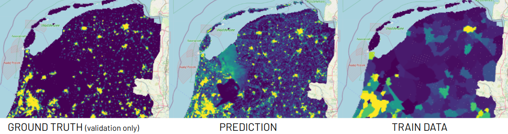
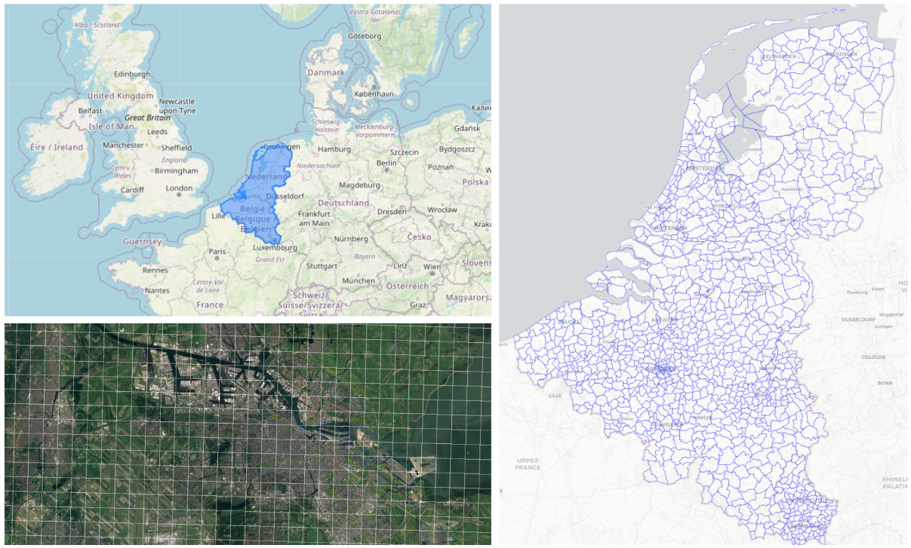
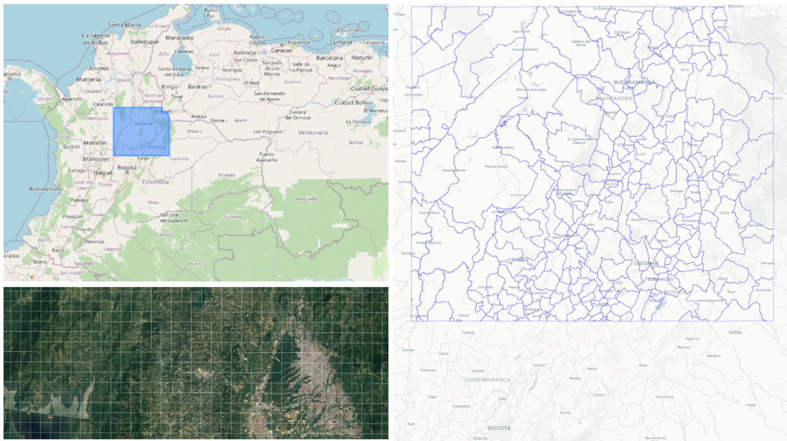
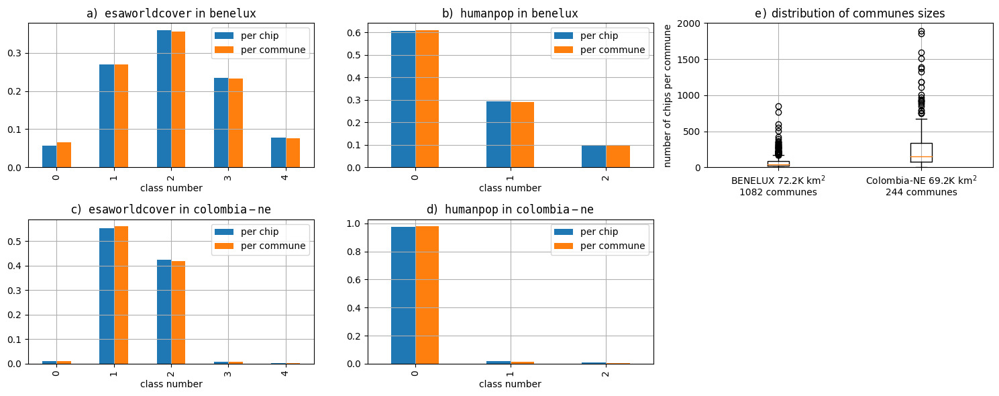
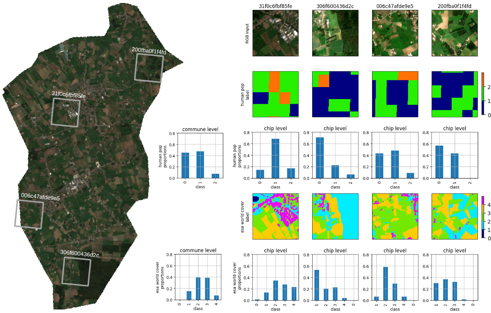
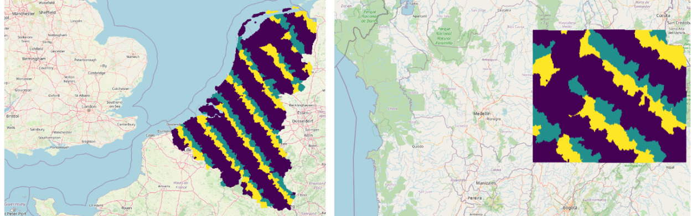
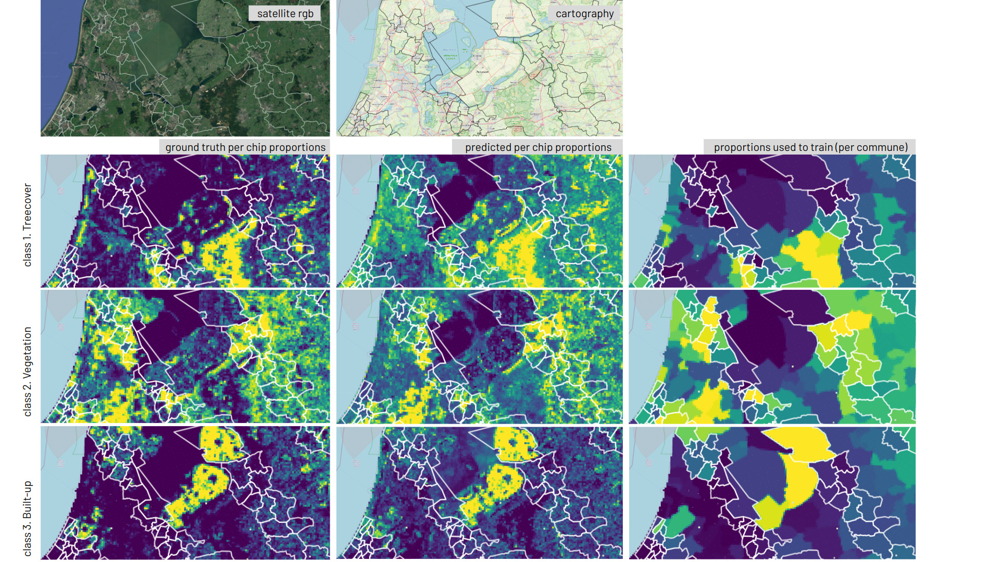
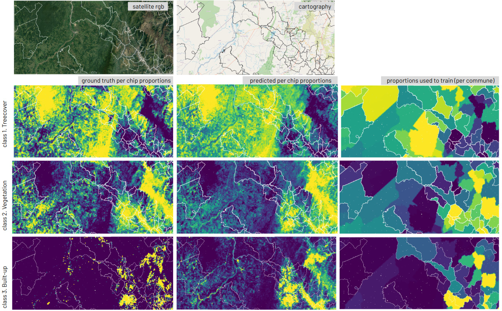
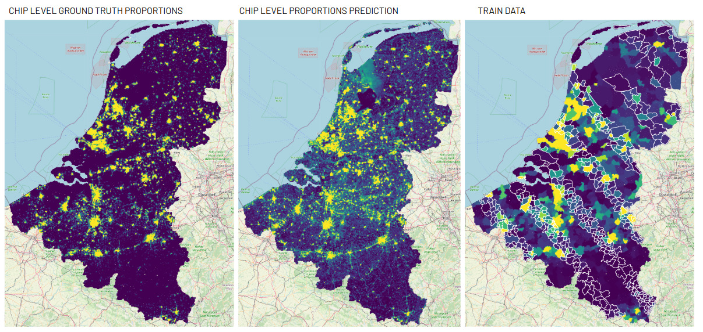

# Lightweight learning with label proportions on satellite imagery

Raúl Ramos-Pollán, _Universidad de Antioquia_, Colombia, raul.ramos@udea.edu.co<br/>
Fabio A. González, _Universidad Nacional de Colombia_, fagonzalezo@unal.edu.co

## Abstract
This work addresses the challenge of producing chip level predictions on satellite imagery when only label proportions at a coarser spatial geometry are available, typically from statistical or aggregated data from administrative divisions (such as municipalities or communes). This kind of tabular data is usually widely available in many regions of the world and application areas and, thus, its exploitation may contribute to leverage the endemic scarcity of fine grained labelled data in Earth Observation (EO). Learning from Label Proportions (LLP) applied to EO data is still an emerging field and performing comparative studies in applied scenarios remains a challenge due to the lack of standardized datasets. In this work, first, we show how simple deep learning and probabilistic methods generally perform better than standard more complex ones, providing a surprising level of finer grained spatial detail when trained with much coarser label proportions. Second, we provide a set of benchmarking datasets enabling comparative LLP applied to EO, providing both fine grained labels and aggregated data according to existing administrative divisions. Finally, we argue how this approach might be valuable when considering on-orbit inference and training.



# <a id="datasets"/> Downloading datasets
The four datasets  in our work with Sentinel2 RGB imagery and different labels are available at Zenodo:

|region |labels| km2| resolution | available at |
|---|---|---|---|---|
|colombia-ne| esaworldcover |69193| 10m| https://zenodo.org/record/7935303|
|colombia-ne |humanpop |69193 |250m |https://zenodo.org/record/7939365|
|benelux |esaworldcover |72213 |10m |https://zenodo.org/record/7935237|
|benelux |humanpop |72213 |250m |https://zenodo.org/record/7939348

The Sentinel 2 image chips are the same in both $\texttt{colombia-ne}$ datasets and both $\texttt{benelux}$, they differ on the labels. Observe that we train our models with label proportions that we obtain from these labels at coarser geometries (communes or municipalities). We only use the actual labels at to compute chip level performance metrics. In a real world scenario these fine grained labels would **not** be available, only the label proportions.

# Running the experiments (tranining models)

1. Download the zip file any of the datasets above and unzip, for instance under `/opt/data`
2. Under `scripts` select the script for `esaworldcover` or `humanpop` that you want to run, and check the location of the `DATASET` variable is correct. The `TAG` will be used to report results to `wandb`
3. Have your `wandb` token ready.
4. Run the experiment:

```
cd scripts
sh run_esaworldcover.sh
```

while running, hiting `ctrl-c` once will abort training, but will still loop through the train, val and test datasets to measure and report results to `wandb`

you can also use the Docker files under `docker` to start a container configured with `tensorflow` to run your experiments on a GPU enabled machine.

# Results and figures

The IPython notebooks under `notebooks` contain the code to generate the figures used in the paper (maps, metrics, etc.), run inference on saved models, etc.

# Extra figures from the paper

The following figures are referenced within the paper

**Figure 6**. $\texttt{benelux}$ area of interest, covering 72.213 $km^2$ (top left). Tiling of $1km \times 1km$ over the surroundings of Amsterdam (bottom left). Subdivision in communes (municipalities) used to compute label proportions (right).


<hr/>

**Figure 7**. $\texttt{colombia-ne}$ area of interest, covering 69.191 km$^2$ (top left, on the north west of South America). Tiling of $1km \times 1km$ over the surroundings of the city of Bucaramanga (bottom left). Subdivision in communes (municipalities) used to compute label proportions (right).


<hr/>

<a id="fig8"/>**Figure 8**. Aggregated distributions of class proportions for $\texttt{colombia-ne}$ and $\texttt{benelux}$ (a,b,c,d). Observe that the distributions are quite similar when aggregated from communes and from chips, as it should be, since the chips cover 100\% of communes. This is also a sanity check for the datasets. The small differences come from chips overlapping several communes at their borders. See Tables II and III for label meanings. Figure e) shows the distribution  of commune sizes in both AOIs. Since each chip is 1 $km^2$ this also represents the distribution of communes sizes in $km^2$


<hr/>

**Figure 9**: $\texttt{benelux}$ selected RGB images from the commune of Ichtegem (Belgium) with fine grained chip level labels (rows two and four) and proportions at chip level (rows 3 and 5). The commune level proportions are shown besides the chip level proportions for $\texttt{esaworldcover}$ and $\texttt{humanpop}$. Recall that we are training using this *commune proportions* shown here assuming that chips do not have individual labels. When a chip intercepts more than one commune, such as chip $\texttt{006c47afde9e5}$ below, its associated commune level proportions are obtained by combining the proportions of the communes it overlaps, weighted proportionally to the amount of overlapping with each commune. Proportions and labels for individual chips are used only to compute performance metrics. See Tables II and III for label meanings.


<hr/>


**Figure 10**: Data splitting for $\texttt{benelux}$ (left) and $\texttt{colombia-ne}$ (right) so that any commune (municipality) has all its chips within the same split. Train is purple, yellow is test, green is validation.


<hr/>

**Figure 11**: Predicting label proportions for $\texttt{esaworldcover}$ over $\texttt{benelux}$ classes 1, 2 and 3. White contours represent communes in test and validation. The rest are used in training.


<hr/>

**Figure 12**: Predicting label proportions for $\texttt{esaworldcover}$ over $\texttt{colombia-ne}$ classes 1, 2 and 3. Recall that class 3 is largely under represented in this dataset. White contours represent communes in test and validation. The rest are used in training.


<hr/>


**Figure 13**: Predicting label proportions for $\texttt{humanpop}$ world cover over $\texttt{benelux}$ class 2 (more than 1600 inhabitants/$km^2$). White contours represent communes in test and validation. The rest are used in training.


<hr/>

